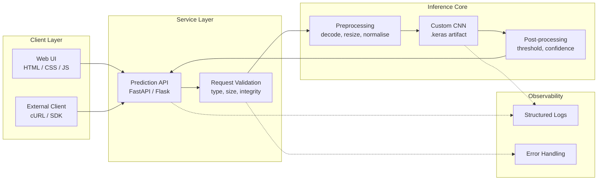
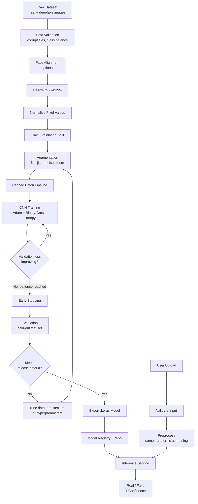
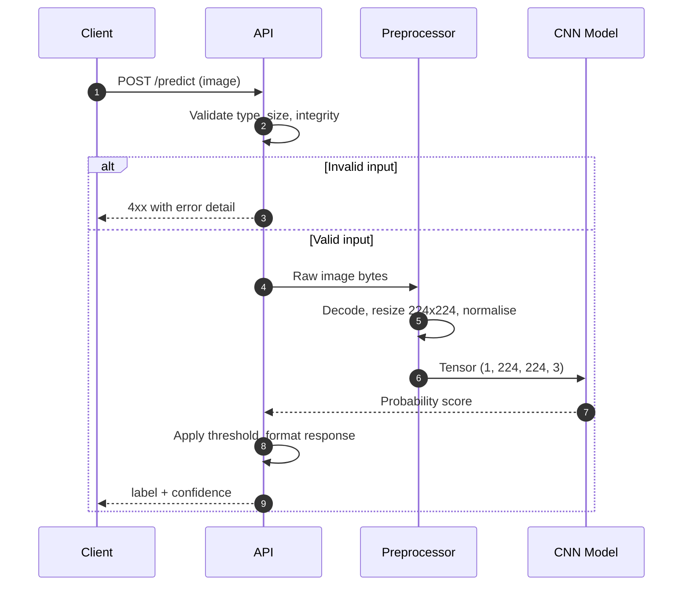
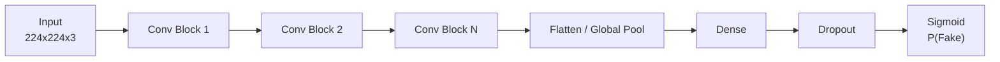
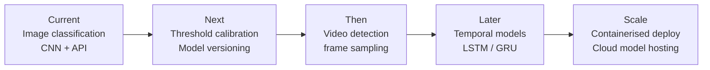

<div align="center">

# REALEYES

### Deepfake detection for face images, built on a custom CNN.

<br>


[Overview](#overview) · [Architecture](#system-architecture) · [Workflow](#end-to-end-workflow) · [Model](#model-specification) · [Training](#training-pipeline) · [API](#api-reference) · [Quick Start](#quick-start) · [Roadmap](#roadmap)

</div>

---

## Overview

Synthetic media is now cheap to produce and hard to spot by eye. It drives misinformation, identity fraud, and social engineering at scale.

**RealEyes** is an end-to-end pipeline that classifies a face image as **Real** or **Fake**. It combines a purpose-built convolutional network with a strict preprocessing stage and a lightweight inference API. The result is a system that is easy to run locally and easy to extend into a larger forensics stack.

| Principle | What it means in practice |
|---|---|
| **Simple** | One command to run locally. No cluster, no GPU required for inference. |
| **Modular** | Preprocessing, model, and serving layers are independent and replaceable. |
| **Measurable** | Every prediction returns a calibrated confidence score, not just a label. |
| **Extensible** | Designed to grow toward video, temporal models (LSTM/GRU), and cloud hosting. |

---

## Capabilities

**Detection**
- Binary Real / Fake classification with a confidence score
- Trained on face-swap, GAN-generated, and blended-region manipulations
- Automatic preprocessing, so callers send raw images
- Regularised with dropout and augmentation to generalise to unseen data

**Serving**
- Image upload interface for fast manual testing
- Backend prediction API with structured logging and error handling
- Portable `.keras` model artifact, ready for REST or cloud deployment

---

## System Architecture



Each layer has a single responsibility. The model can be swapped, the API framework changed, or the frontend replaced without touching the other layers.

---

## End-to-End Workflow

The full lifecycle runs from raw data to a served prediction, in two connected loops: **training** (offline) and **inference** (online).



> **Training / serving parity.** The inference path applies the same resize and normalisation as training. Any mismatch between the two is a common cause of silent accuracy loss, so keep the transforms in one shared module.

### Inference sequence



---

## Model Specification

| Component | Detail |
|---|---|
| Framework | TensorFlow / Keras |
| Architecture | Custom CNN |
| Input | 224 × 224 RGB |
| Output | Single sigmoid unit: probability of *Fake* |
| Loss | Binary Cross-Entropy |
| Optimiser | Adam |
| Regularisation | Dropout, data augmentation, early stopping |
| Artifact | `.keras` |



> Replace the block counts and layer sizes above with the exact configuration from your training notebook.

### Training data

A balanced set of real and manipulated face images covering three manipulation families:

| Family | Description |
|---|---|
| Face-swap | Identity from one subject transplanted onto another |
| GAN-generated | Fully synthetic faces with no real source |
| Blended regions | Local facial edits composited into a genuine image |

---

## Training Pipeline

| Stage | Steps |
|---|---|
| **1. Preparation** | Load dataset, optional face alignment, resize, normalise |
| **2. Augmentation** | Random horizontal flip, brightness and contrast jitter, noise injection, slight random zoom |
| **3. Training** | Batched training with efficient caching, validation monitoring, early stopping |
| **4. Evaluation** | Held-out test set, confusion matrix, per-manipulation breakdown |
| **5. Export** | Save `.keras` artifact and version it alongside its preprocessing config |

### Reported performance

Fill this table from your final evaluation run.

| Metric | Value |
|---|---|
| Accuracy | — |
| Precision (Fake) | — |
| Recall (Fake) | — |
| F1 score | — |
| ROC-AUC | — |

---

## Detection Signals

Generative models leave measurable traces. The network is trained to pick up on low-level patterns that are hard for a human to notice.

| Signal | Cause |
|---|---|
| **Texture inconsistency** | GANs struggle to reproduce natural skin micro-texture uniformly. |
| **Boundary artifacts** | Blending seams where a replacement face meets the original frame. |
| **Lighting mismatch** | Shadow direction and specular highlights that disagree across the face. |
| **Eye and teeth distortion** | Fine structures that generators often render with subtle errors. |

---

## API Reference

> Endpoint names below are the recommended contract. Adjust them to match your backend.

### `POST /predict`

Classify a single image.

**Request**

```bash
curl -X POST http://localhost:8000/predict \
  -F "file=@sample.jpg"
```

**Response `200`**

```json
{
  "label": "fake",
  "confidence": 0.9312,
  "model_version": "1.0.0",
  "inference_ms": 48
}
```

**Errors**

| Code | Meaning |
|---|---|
| `400` | Missing file or unreadable image |
| `413` | File exceeds the size limit |
| `415` | Unsupported media type |
| `500` | Inference failure, see server logs |

---

## Quick Start

```bash
# 1. Clone
git clone https://github.com/<your-username>/RealEyes.git
cd RealEyes

# 2. Create an isolated environment
python -m venv .venv
source .venv/bin/activate        # Windows: .venv\Scripts\activate

# 3. Install dependencies
pip install -r requirements.txt

# 4. Run the service
python app.py                    # or: uvicorn app:app --reload
```

Open `http://localhost:8000`, upload an image, and read the verdict.

### Suggested project layout

```text
RealEyes/
├── model/            # trained .keras artifact
├── src/
│   ├── preprocess.py # shared transforms (training + inference)
│   ├── train.py
│   ├── evaluate.py
│   └── predict.py
├── api/              # service layer
├── frontend/         # minimal upload UI
├── requirements.txt
└── README.md
```

---

## Tech Stack

| Layer | Technology |
|---|---|
| Machine learning | TensorFlow, Keras |
| Backend | Python, FastAPI or Flask |
| Frontend | HTML, CSS, JavaScript |
| Utilities | NumPy, Pillow, OpenCV |

---

## Limitations

A detector is a probabilistic tool, not proof. Read these before relying on it.

- **Distribution shift.** Performance can drop on manipulation methods absent from the training data. New generators appear constantly.
- **Image quality.** Heavy compression, low resolution, and re-uploads can erase the artifacts the model depends on.
- **Not a legal verdict.** Treat the confidence score as one signal in a wider review process, especially for high-stakes decisions.
- **Adversarial inputs.** A determined attacker can craft images designed to evade detection.

---

## Roadmap



- [x] Custom CNN classifier with confidence output
- [x] Preprocessing pipeline and upload interface
- [ ] Explainability maps (Grad-CAM) to show *why* an image was flagged
- [ ] Video pipeline with frame-level aggregation
- [ ] Docker image and CI for tests and linting
- [ ] Public benchmark results across multiple datasets

---

## Contributing

Issues and pull requests are welcome. For larger changes, open an issue first so the approach can be discussed.

1. Fork the repository
2. Create a feature branch
3. Commit with clear messages
4. Open a pull request describing what changed and why

---

## Author

**Aayush Shukla**

---

<div align="center">

If RealEyes is useful to you, consider starring the repository. It helps others find it.

</div>
